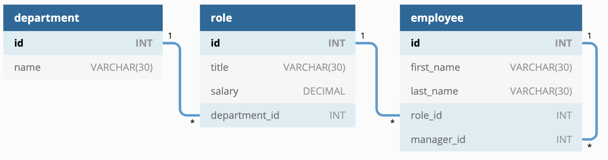

# Stev232sTeamBuilder

## Description

## Acceptance Criteria

GIVEN a command-line application that accepts user input  
__WHEN__ I start the application  
*THEN* I am presented with the following options: view all departments, view all roles, view all employees, add a department, add a role, add an employee, and update an employee role  
__WHEN__ I choose to view all departments  
*THEN* I am presented with a formatted table showing department names and department ids  
__WHEN__ I choose to view all roles  
*THEN* I am presented with the job title, role id, the department that role belongs to, and the salary for that role  
__WHEN__ I choose to view all employees  
*THEN* I am presented with a formatted table showing employee data, including employee ids, first names, last names, job titles, departments, salaries, and managers that the employees report to  
__WHEN__ I choose to add a department  
*THEN* I am prompted to enter the name of the department and that department is added to the database  
__WHEN__ I choose to add a role  
*THEN* I am prompted to enter the name, salary, and department for the role and that role is added to the database  
__WHEN__ I choose to add an employee  
*THEN* I am prompted to enter the employee’s first name, last name, role, and manager, and that employee is added to the database  
__WHEN__ I choose to update an employee role  
*THEN* I am prompted to select an employee to update and their new role and this information is updated in the database  

## Database architecture

* department
    * id: INT PRIMARY KEY
    * name: VARCHAR(30) to hold department name
* role
    * id: INT PRIMARY KEY
    * title: VARCHAR(30) to hold role title
    * salary: DECIMAL to hold role salary
    * department_id: INT to hold reference to department role belongs to
* employee
    * id: INT PRIMARY KEY
    * first_name: VARCHAR(30) to hold employee first name
    * last_name: VARCHAR(30) to hold employee last name
    * role_id: INT to hold reference to employee role
    * manager_id: INT to hold reference to another employee that is the manager of the current employee (null if the employee has no manager)

